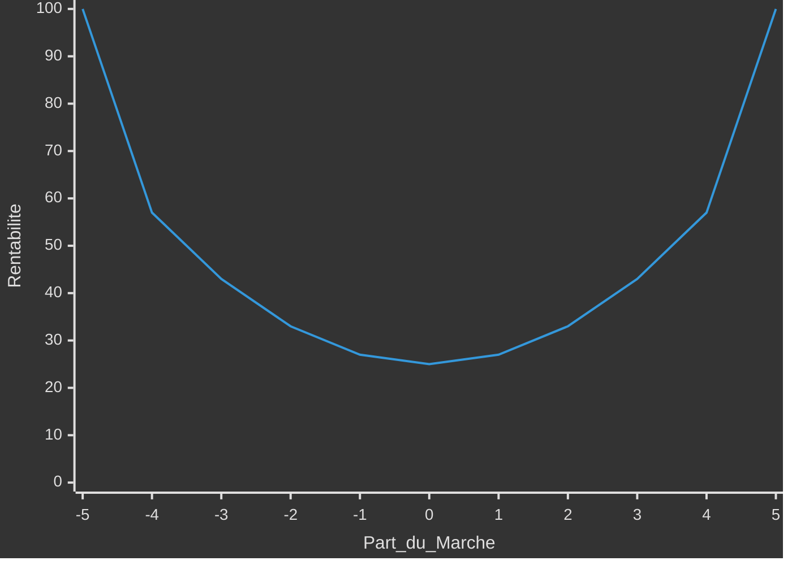
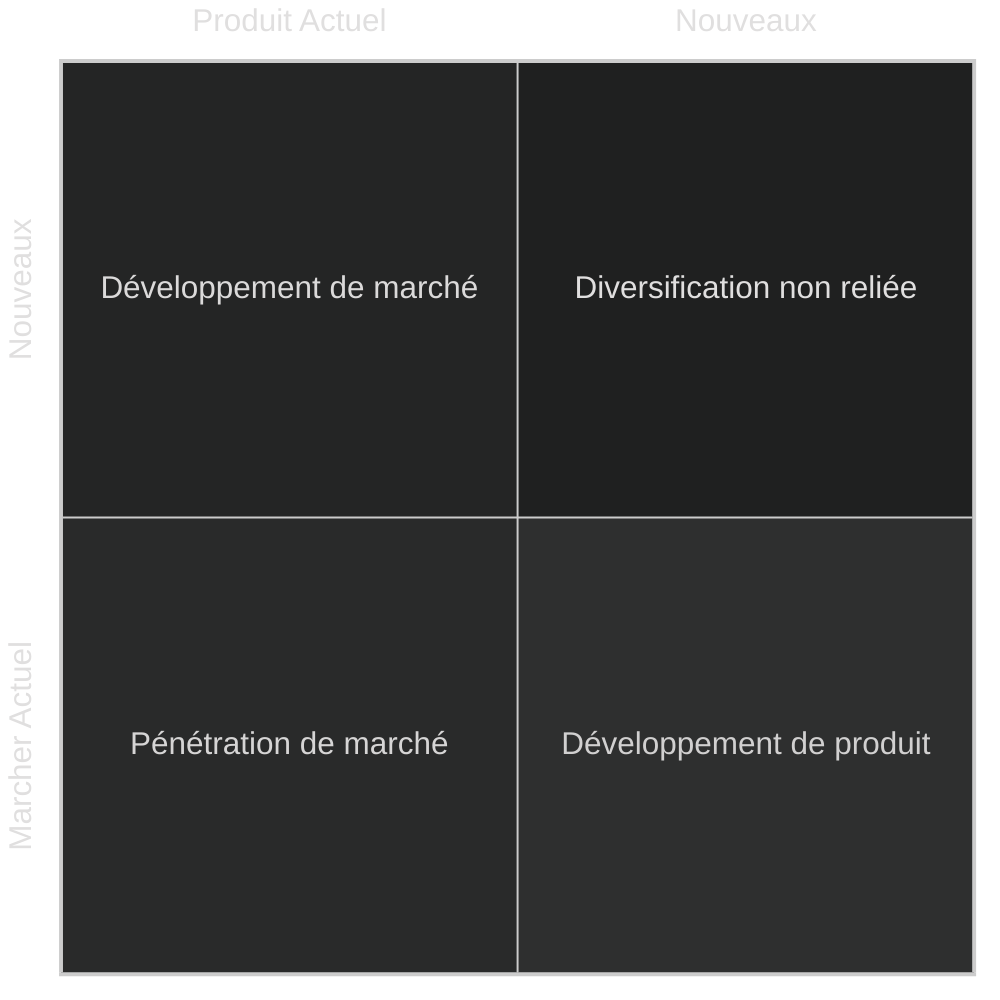
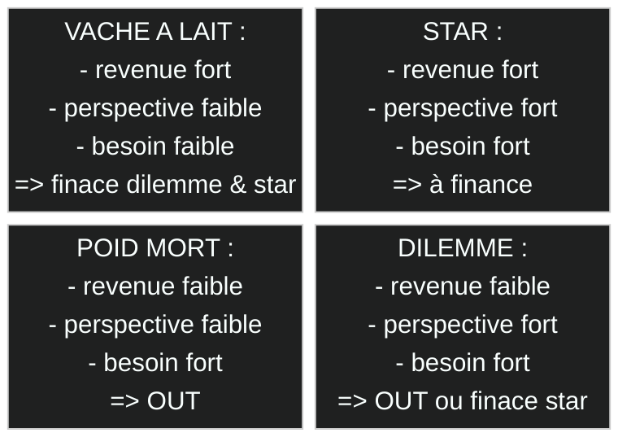
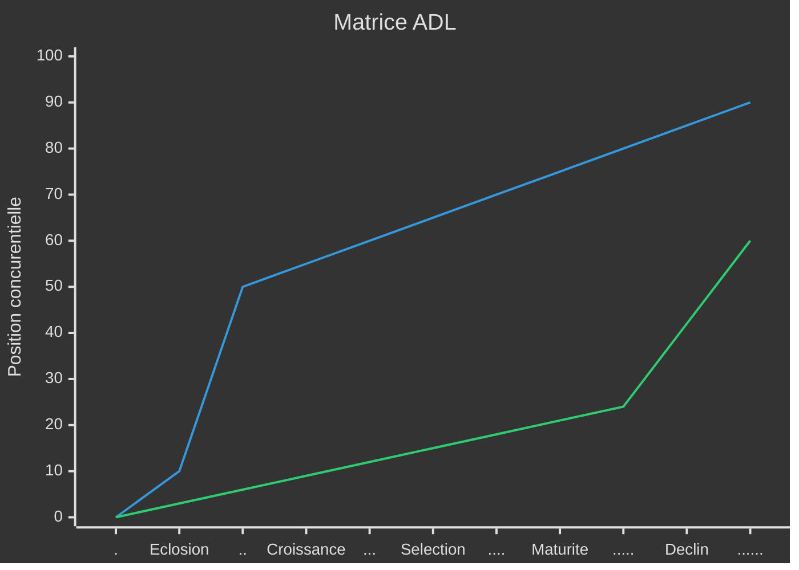
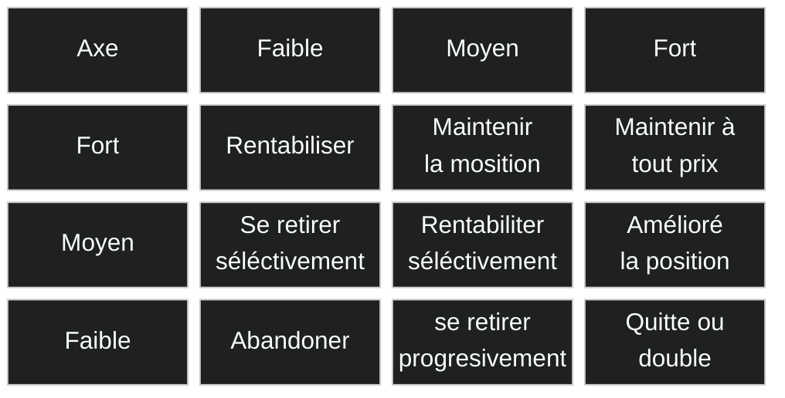

# Strategies des entreprises

> Il sera peut-être préferable de commencé par le cour d'[introdution au management](#0-introduction.md)

La **stratégie** d’une entreprise est l’ensemble des ***décisions*** et des actions coordonnées lui permettant d’atteindre ses objectifs à ***long terme*** et de lui fournir un ***avantage*** compétitif unique.

Dans ce cours, on cherchera à mettre en place des débuts de solution pour que l'entreprise se démarque des autres.

- [Strategies des entreprises](#strategies-des-entreprises)
  - [Stratégie concurrentielle](#stratégie-concurrentielle)
    - [3 type de domination](#3-type-de-domination)
    - [Horloge stratégique](#horloge-stratégique)
    - [Océan](#océan)
    - [Innovation de valeur](#innovation-de-valeur)
    - [Théorie des jeux](#théorie-des-jeux)
  - [Stratégie de croissance](#stratégie-de-croissance)
    - [Voie](#voie)
      - [Matrice d'Ansoff](#matrice-dansoff)
      - [Internationalisation](#internationalisation)
      - [Integration](#integration)
    - [Mode](#mode)
      - [Intreprenariat](#intreprenariat)
      - [Acquisitions](#acquisitions)
    - [Porteufeuil d'activité](#porteufeuil-dactivité)
      - [Matrice BCG](#matrice-bcg)
      - [Matrice Arthur D. Little](#matrice-arthur-d-little)
      - [Matrce Mckinsey](#matrce-mckinsey)
      - [Aventage](#aventage)
  - [Annex](#annex)
    - [Remerciment](#remerciment)

## Stratégie concurrentielle

Sur un marché très concurrentiel, il faut prendre en compte les interactions entre compétiteurs et parfois choisir entre ***compétition et coopération***.
Comment être compétitif ***sur mon marché*** ?

### 3 type de domination

- **Coût** : avoir les couts les plus bas ;
  - Diminuant les coûts directs,
  - Exploitant des effets d’échelle,
  - Utilisant l’effet d’expérience,
  - Optimisant les produits
  - Optimisant les processus
- **Différentiation** : Valorisation d'un facteur qui justifie un prix plus élévation ;
  - Caractéristiques
  - Relation
  - Complémentarité
- **Focus** : orientée exclusivement ver un segment de marcher

Pour Porter, l’entreprise doit développer une seule de ces stratégies sur chacun de ses domaines d’activités stratégiques.
Le risque est d'avoir les 2 inconvenants et donc de ne pas avoir une bonne rentabilité.

### Horloge stratégique

### Océan

Catégorie | Rouge | Bleu |
|:-:|-|-|
| espace de marché | Se battre | non contesté|
| les concurrents | Vaincre  | Faire perdre ***pertinence*** |
| les demandes | Exploiter une  existante | Créer et saisir une ***nouvelle***|
| valeur/coût | Arbitrer entre | Sortir de l’***arbitrage*** |
| choix stratégique | différentiation **ET** des coûts bas | différentiation **OU** coûts bas |

Les **océans bleus** créés par des ***acteurs établis*** dans leur cœur de métier. Ce qui compte est plutôt l’***avancée stratégique***, la création d’un marché à travers l’***innovation par la valeur*** [value innovation]. ***Pas due uniquement à l’innovation technologique***.

### Innovation de valeur

C'est la jonction entre la baisse des couts et le ressenti de valeur par les clients.

- **Éliminer** les éléments qui n'apportent rien.
- **Réduire** les éléments qui amènent un surcoût non perçu.
- **Élever** les éléments moins exploités pour les clients
- **Créer** de nouveaux éléments sur le marché.

### Théorie des jeux

Comme le gain de chacun dépend des décisions de tous les autres.
La théorie des jeux est un ensemble de concepts pour décrire et prévoir le ***comportement et les interactions*** qui s’influencent mutuellement.
Elle repose sur le postulat que chacun des acteurs va toujours chercher rationnellement à ***maximiser ses gains et minimiser ses pertes***.
Il y a équilibre lorsqu'aucun des joueurs ***ne regrette*** son choix. Attention, l’équilibre n’est pas forcément optimal.

## Stratégie de croissance

étudie comment l’entreprise peut se développer dans d’autres ***directions*** (produits, marchés) et par quels moyens et méthodes.
Création de synergie entre les activités

quelles [groupe d'activité](1-introduction.md#groupe) l’entreprise doit-elle se développer ?
dévloppé de nouveaux produit ou marché
faire de façon interne ou extene
géré un portefeuille d'activité

### Voie

La **Spécialisation** : en [phase](#cycle-de-vie) d'***eclosion ou croissance***.
La **Diversification** : en phase de ***maturité ou déclin***

#### Matrice d'Ansoff

- Nouveaux **produit** :  vente de nouveaux produit pour ses prospet actuel par la ***complémentarité***.
- Nouveaux **marchés** : trouver aux produits de ***nouveaux usages et d’utilisateurs*** par une extension géographique. L’entreprise doit apprendreà se familiariser d’autres ***cultures***.
- Pénétration de marché : vente de produit exitant pour ses prospet actuel ; on vise à acroire les ventes en fidélisant les clients pour augmenté sa part de marcher.

|Categorie|Nouveaux Produit|Nouveaux Marcher|Diversification non relier|Penetration de marcher|
|-|-|-|-|-|
|Marcher|✔ Connue, ❌ nouveau concurent|❌ nouveau concurent||❌ Durcissement de la concurrence par son étroitesse ou baisse|
|Competence|✔ des produit novelle, ❌ acquisition difficile|✔ des marcher novelle||✔déjà en place ❌ pas de nouvel|
|Produit|✔ Sinergie avec les ancien, ✔ Gestion de cycles de vie|✔ Maitriser avec des produit en "tete de pont"||❌ obsolecence|
|Experience|✔ utilisable pour les produit existant|✔ utilisable pour les marcher existant||✔ pouvoir accru sur acheteur et fourniseur|
|Cout|✔ Effet Echelle, ❌ de développement elever|✔ Effet Echelle, ❌ implantation élevés||✔ effet d'experience, ✔ pas de cout dvpt produit, ❌ Baisse des Prix et de la rentabilité|
|Projet|❌ risqué, ❌ facteur cleé differant|✔ risque repartie sur les marcher, ❌ facteur cleé differant||✔ risque connus et limité|
|Organisation|❌ plus complexe|❌ plus complexe||✔ mise ne oeuvre rapide|

#### Internationalisation

La recherche d’économies d’échelle, de coûts de production locaux plus faibles, ou de volumes de vente plus importants du besoins clients similaires à ceux du pays d’origine est également une motivation pour  internationaliser ses activités.

- **Export** : Expédie ses produits depuis son pays et utilise un réseau de distribution local.
- **License / Franchise** : accord contractuel permettant à un  partenaire local d’utiliser la technologie / la marque.
- **Joint venture** : l’entreprise et un partenaire local sont co-actionnaires.
- **Filiale** : création ou rachat d’une entité locale détenue à 100% par  l’entreprise.

#### Integration

Une voie de diversification stratégique consiste à intégrer des activités appartenant à la ***même chaîne de valeur***.

**Vertical :**
  
|Avantages ✔|Inconvénients ❌|
|-|-|
|Connaissance du secteur d’activité|Rentabilité des activités amont / aval potentiellement plus faiblexe|
|Connaissance des clients finaux|Perte de clients ou fournisseurs|
|Augmentation de la valeur ajoutée|Compétences et ressources requises différentes|
|Pouvoir accru sur les acheteurs ou fournisseurs restants (contrebaliser les forces)|Rétorsion de la part des clients ou fournisseurs concurrencés|
|Sécurité de l’approvisionnement (amont) ou de la distribution (aval)|Concentration du risque marché|
|Cible connue|Différents facteurs clés de succès|
|Préssion sur les concurents||

**Horisontal :**

|Avantages ✔|Inconvénients ❌|
|-|-|
|Compétences et ressources requises proches, synergies et effets d’échelle|Compléxité suplémentaire|
|Technologies croisées|Dilution des ressource|
|Pouvoir accru sur fournisseurs si synergies achats entre activités|Diférent clés de succès, client et secteur d'activité|
|Acquisition de nouveaux clients|Nouveaux concurent|
|Repartition du risque||

### Mode

L’entreprise peut décider de compter sur ses ***capacités actuelles*** en les développant et ainsi choisir la croissance interne ou la croissance externe et ***acquérir*** de nouvelles ressources et compétences.

#### Intreprenariat

|Avantages ✔|Inconvénients ❌|
|-|-|
|Coût initial plus faible|Peut revenir plus cher à long terme|
|Investissement plus régulier|Effort pour recréer la chaîne de valeur|
|Recul ou abandon plus facile|Résultats plus longs à obtenir|
|Apprentissage et expérience|Dilution des ressources existantes|
|Fort outil de motivation|Désorganisation et démotivation si échec ou stagnation|
|Indépendance conservée|Peu adapté aux changements radicaux|
|Décision rapide, processus maîtrisé (arret possible)|Risque de l’entre-soi|

#### Acquisitions

|Avantages ✔|Inconvénients ❌|
|-|-|
|Economies d’échelle potentielles (synergies et redondances)|Fonds nécessaires importants|
|Bénéfice immédiat de la position marché existante de la cible|Soumis à l’acceptation de la cible|
|Résultats réels connus et tangibles|Processus d’acquisition long et incertain|
|Acquisition de technologies de rupture, de compétences rares|Peut être soumis à accord des autorités|
|Echanges de bonnes pratiques|Cultures d’entreprise différentes|

### Porteufeuil d'activité

Prendre des décisions stratégiques concernant l’***allocation des ressources***, le renforcement, le désengagement ou la cession de chaque DAS (Domaine d’Activité Stratégique).

#### Matrice BCG

Determiner l'attractivité et l'équilibre d'un portefeuille d'activité

- **Croissance du marché** (abscisse) : par rapport à la ***croissance économique moyenne*** ou le degré de maturité de l’industrie.
- **Part de marché relative** (ordonnée) : part de marché de l’entreprise sur le concurrent principal
- **Poids du DAS** dans le CA de l’entreprise en % (taille de la bulle)

Ainsi les "vache à lait" qui gener l'argent de magner efficient permet de finacer les "dilemmes" pour qu'il devient des "stars" qui à long terme deviendra des vache à lait. Les ***risques*** financiers, sectoriels
et concurrentiels sont ***minimisés*** et répartis. (cercle vertueu)

#### Matrice Arthur D. Little

Matrice dynamique qui intègre le ***cycle de vie*** du secteur d’activité. Selon la ***phase de maturité*** du secteur et la position concurrentielle du DAS, chaque DAS peut se trouver dans une des 3 zones stratégiques.

- **Naturel** : Le DAS est en bonne position concurrentielle et a des perspectives de marché prometteuses.
L’entreprise doit accompagner son développement.
- **Sélection** : L’entreprise doit choisir entre les différents DAS les plus prometteurs et investir pour améliorer leur rentabilité.
- **Abandon** : L’entreprise doit désinvestir ou céder les DAS de cette zone.

#### Matrce Mckinsey

Permet d’aller ***plus loin que la BCG*** en diversifiant les critères, selon l'attrait et ses atouts.

- **Attrait de l’activité**
  - Taille et taux de croissance du marché
  - Rentabilité du secteur
  - [Intensité concurrentielle](#6-force-de-porteur)
  - [Risques et opportunités](#externe)
- **Atouts de l’entreprise**
  - Qualité des produits et services
  - [Capacité distinctives](#capacité)
  - [Forces et Faiblesses](#interne)

#### Aventage

- Un portefeuille **équilibré** est situation favorable pour l’entreprise pour prendre des décisions stratégiques.
- L’entreprise **diversifiée** doit gérer plusieurs activités pas nécessairement reliées entre elles.
- La **holding** peut apporter de la valeur à l’ensemble en :
  - fournissant la ***vision*** et la ***stratégie***
  - facilitant les ***synergies*** entre activités
  - développant les compétences des ***managers***
  - offrant des ***services centraux***, des ressources artagées, du conseil interne
  - contrôlant la ***performance*** des activités et prenant les actions correctives si nécessaires.

## Annex

### Remerciment

Je remarci SIMON Nicolas Professeur à l'IA School en 2024 pour son cour d'introduction au strategie de developpement d'entreprise
<!-- crée par WyloW2RicardO le 2024-03-10 -->
