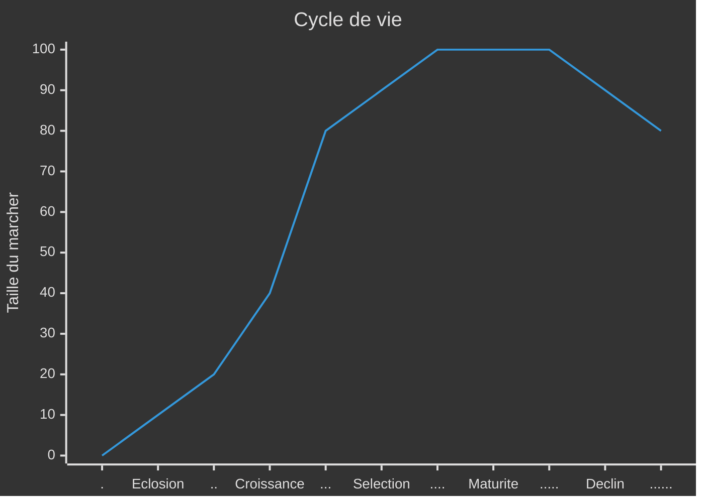
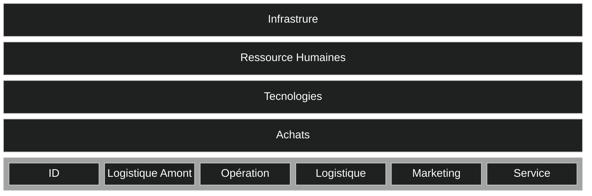
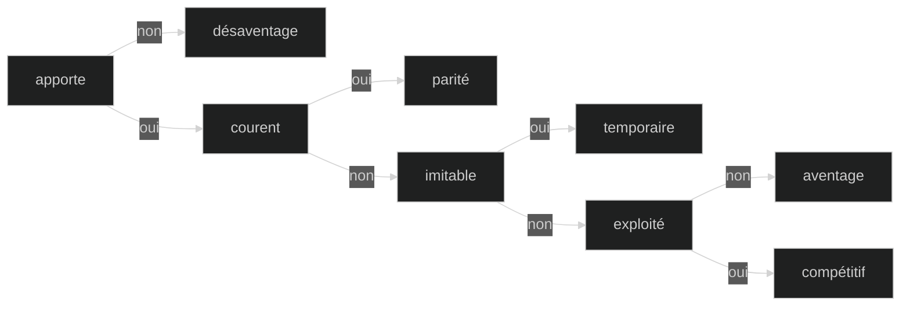
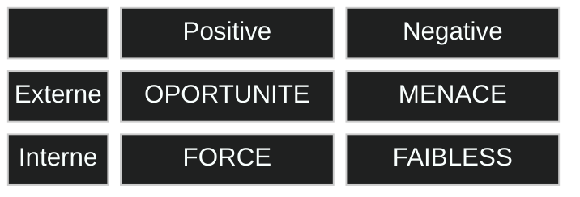
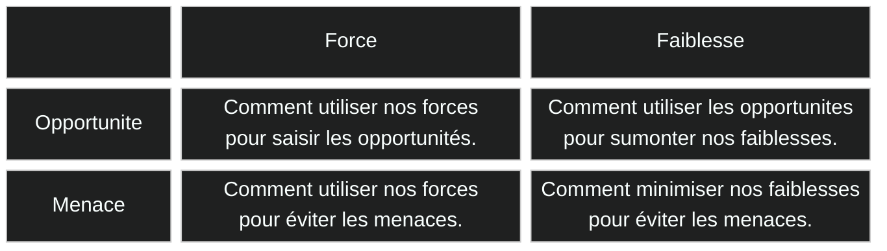

# Diagnostique des Entreprises

Déterminer la **position stratégique** de l’entreprise et ses choix potentiels.
>Varier les points de vue avec des avis interne et externe pluridisiplinaire.
Hiérarchiser et sélectionner les plus pertinentes.

- [Diagnostique des Entreprises](#diagnostique-des-entreprises)
  - [Externe](#externe)
    - [Macro-environnement](#macro-environnement)
      - [PESTEL](#pestel)
    - [Mezzo-environnement](#mezzo-environnement)
      - [Structure](#structure)
      - [Cycle de vie](#cycle-de-vie)
    - [Micro-environnement](#micro-environnement)
      - [6 force de Porteur](#6-force-de-porteur)
  - [Interne](#interne)
    - [Chaine de valeur](#chaine-de-valeur)
    - [Capacité](#capacité)
      - [Modèle VRIO](#modèle-vrio)
  - [Synthétiser](#synthétiser)
    - [Matrice SWOT](#matrice-swot)
    - [Matrice TOWS](#matrice-tows)

## Externe

Identifier ***les risques et les opportunités***, rechercher des **facteurs de succès** valorisés par le marché et ***évaluer*** le potentiel de croissance et l’attractivité du secteur pour ***esquisser*** des stratégies possibles.

### Macro-environnement 

Les grandes tendances du monde extérieur sur le long terme pouvant influencer l’entreprise.

#### PESTEL

Déterminer les principaux facteurs macro qui influencent l’activité.

- **Politique** : les lois et politiques exercées par les groupes ainsi que leur stabilité ; de pression, lobbies, gouvernementaux, collectivités.
- **Économique** : les couts et les taux ; croissance, intérêts, change.
- **Sociétal** : les cultures et la démographie ; géographique, richesse, consommation, éducation, habitudes, éthique.
- **Technologique** : les innovations et l'infrastructure
- **Écologie** : la gestion, le développement et la responsabilité durable
- **Légal** : les différentes réglementations mises en place.

### Mezzo-environnement

#### Structure

Identifier les structures pour chaque niveau du [groupe d'activité](0-introduction.md#groupe).

- **Monopole** : industrie dominée par ***une*** entreprise avec peu de compétition, un fort pouvoir sur les clients.
- **Oligopole** : industrie dominée par ***quelques*** entreprises avec peu de compétition entre elles, un fort pouvoir sur les clients et les fournisseurs.
- **Parfaite compétition** : industrie ***non*** dominée avec compétition sur les prix, sans barrière.

#### Cycle de vie

- **Éclosion** : l'innovation et la technologie sont primordiales.
Les produits sont différenciés et la concurrence est faible.
Les profits sont faibles et les investissements élevés.
- **Croissance** : le marché est vaste et permet une croissance forte.
Les barrières à l’entrée sont faibles, de nouveaux concurrents apparaissent.
Le pouvoir des acheteurs est faible.
- **Sélection** : le marché se sature peu à peu, la croissance ralentit.
La concurrence devient plus intense, les plus forts augmentent leurs profits et les plus faibles disparaissent ou sont absorbés.
- **Maturité** : le marché est saturé et stagne, les barrières à l’entrée sont fortes.
Les produits se standardisent, les profits sont élevés.
Le pouvoir des acheteurs est fort et le prix est primordial.
- **Déclin** : les acheteurs se détournent peu à peu, le marché décroît.
Le nombre de concurrents diminue, les profits sont encore possibles si situation de monopole ou d'oligopole.

### Micro-environnement

#### 6 force de Porteur

Déterminer si le secteur est attractif et identifier les possibilités stratégiques et leur impact.

- **Concurrence** : nombre, positions, croissance, cycle de vie, coûts, investissements
- **Entrants** : économies, circuits, capitaux, législation, acteurs présents
- **Substitution** :
- **Acheteur** : leur impact, leur profit nécessaire, leur qualité, leur nombre
- **Fournisseurs** : leur nombre, changement, différents produits
- **Complément** :

## Interne

Identifier les caractéristiques de l’entreprise pertinentes au regard de son industrie.
Évaluer les ***forces et faiblesses*** de l’entreprise par rapport à ses concurrents.
Déterminer les **capacités distinctives** de l’entreprise.

### Chaine de valeur

L’analyse de la chaîne de valeur permet de comprendre et d’**identifier les gisements** de création de valeur au sein de l’entreprise. Elle permet également de calculer le rapport entre la ***valeur apportée*** et le ***coût engendré*** par l'entreprise, mais aussi en ***amont et en aval***.
Pour chaque activité de l'entreprise, on peut comparer chaque secteur d'activité dans une autre entreprise sans lien nécessaire. Pour ***transposer*** les activités performantes à son entreprise.[Benchmarking]

### Capacité

Une fois avoir recensé les différentes chaines de valeur, on peut identifier les réelles capacités au-dessus du ***seuil*** qui ne cesseront jamais d'augmenter.
Elle contribue à sa pérennité et ***potentiellement*** à créer un avantage compétitif.

- **Ressources** : ***actifs tangibles ou intangibles*** qu'elle a à disposition. (nom commun)
- **Compétences** : ***procédés*** qui permettent d'exploiter ses ressources. (verbe)

#### Modèle VRIO

On détermine si chaque capacité est stratégique.

- **Valeur** : capacité qui contribue à la ***création ou réduit*** les coûts du produit, exploite l'***environnement*** qu'elle ***apporte*** aux clients.
- **Rareté** : capacité maitrisée par ***très peu*** de concurrents.
- **Inimitabilité** : capacité difficile à imiter ou à substituer due à une ***complexité*** du processus ou de l'infrastructure complexe par l'accumulation de savoir-faire culturel et historique.
- **Organisme** : la capacité est correctement ***exploitée***.

## Synthétiser

Les environnements [externe](#externe) et [interne](#interne) doivent être en constante évolution pour maintenir un avantage compétitif. Il faut avoir une **capacité dynamique** à ***réorganiser*** ses activités par l'***anticipation*** des évolutions et à ***saisir*** les opportunités.

### Matrice SWOT

Outil pour mettre en lumière la ***situation stratégique*** (donnée) par la mise en relation de l'environnement externe et interne.

### Matrice TOWS

Outil pour mettre en lumière les ***stratégies possibles*** (piste) par le croisement des rubriques de la matrice SWOT.

<!-- il faut aller à la ligne -->
