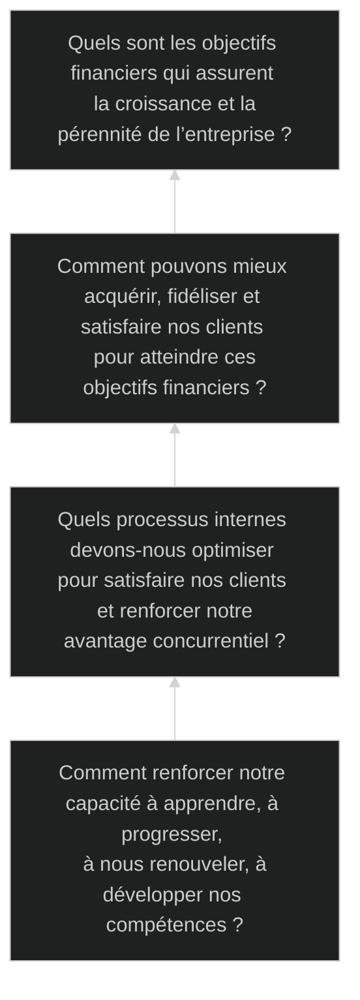

# Le Plan strategique

Une fois son [positionnement stratégique](diagnostique.md) établi et les [choix stratégiques](choix.md) faits, l’entreprise doit traduire ses intentions en actes concrets.

Elle s’attachera tout d’abord à identifier les ***outils et indicateurs*** pertinents pour évaluer et
mesurer sa performance.

Ensuite, le plan stratégique devra être bâti et décliné en plans opérationnels sur ***toutes les composantes*** de l’entreprise.

Enfin, la contribution de chaque collaborateur se traduira par la fixation d’***objectifs SMART***.

- [Le Plan strategique](#le-plan-strategique)
  - [Mesurer la performance](#mesurer-la-performance)
    - [Indicateur economique](#indicateur-economique)
      - [Calculs](#calculs)
    - [Indicateur large](#indicateur-large)
      - [Tableau de bord équilibré](#tableau-de-bord-équilibré)
      - [Triple résultat](#triple-résultat)
  - [Bâtir le plan](#bâtir-le-plan)
    - [Global et Local](#global-et-local)
    - [Opérationnel](#opérationnel)
    - [SMART](#smart)

## Mesurer la performance

### Indicateur economique

On peut mesurer les performances purement économiques d’une entreprise et d’une stratégie (marcher, boursier, rentabilité).

#### Calculs
- **compte de résultat** : permet des comparaisons entre entreprises, entités, filiales,...
  - EBIT = Earnings Before Interest & Taxes
  - EBITDA = Earnings Before Int, Tax, Depreciation & Amortization
- **Profit** : mesure la rentabiliter d'un projet
  - ROI = Return On Investment $=\frac{\textit{profit généré}}{\textit{coût total}}$
  - ROCE = Return On Capital Employed $=\frac{\textit{profit opérationel}}{\textit{capitaux utilisés}}$
- **Temps de rembousement** : mesure le temps nécessaire pour que les flux de trésorerie cumulés générés pour quel’investissement remboursent son coût.
  - paybak period
  - discountted cashflow

### Indicateur large

On peut également introduire d’autres critères de mesure pour rendre compte de facteurs plus larges (processus, partiprenate, reputation).

#### Tableau de bord équilibré

Afin de contrebalancer les indicateurs purement financiers et rendre compte des multiples aspects de la performance, *R. Kaplan et D. Norton* proposent un modèle innovant.
Ce tableau de bord propose ***4 axes***

#### Triple résultat

ligne du bas du compte de résultat fait refernece au ***résultat net***.
Les résultats sont donc publiés dans les rapports annuels et sont scrutés par les investisseurs de fonds ESG.
Le concept de triple bottom line invite à prendre en compte les ***3 axes du développement durable*** : **social, économique et environnemental**.

## Bâtir le plan

### Global et Local

Chaque [grandes fonctions](diagnostique.md#chaine-de-valeur) doit s’interroger sur sa contribution à l’objectif stratégique et proposer des objectifs opérationnels.
***Chaque entité définit sa stratégie locales***, ses objectifs partielles et son plan stratégiques fonctionnelles, de l’entreprise.
Ces stratégies locales ***découlent de la stratégie globale*** et contribuent à l’atteinte des objectifs de l’entreprise.

Elles ***influencent également la stratégie globale*** en définissant les capacités stratégiques, en fournissant leur expertise et la connaissance de leur environnement, en proposant des axes de développement et ***dessinant les limites du possible***.

### Opérationnel

La définition des objectifs stratégiques entraîne obligatoirement la définition d’objectifs opérationnels, implique que l’objectif stratégique associé est ***« divisé » en plusieurs objectifs opérationnels***.

Il peut être intéressant de fixer les objectifs opérationnels de telle façon que la somme de leurs ***contributions soit supérieure à la valeur de l’objectif*** stratégique.
Ainsi, en cas de non-atteinte d’un objectif opérationnel, l’objectif stratégique n’est ***pas immédiatement menacé***.

La déclinaison des objectifs et plans d’un niveau supérieur aux niveaux inférieurs peut entraîner l’apparition de ***conflits d’intérêts***.
Un même service ou un même individu peut avoir à gérer des objectifs antagonistes.
On ***peut alors*** hiérarchiser les objectifs, en fixer les contraintes, ou trouver un objectif commun, en ligne avec la stratégie.
C’est aux managers et en dernier recours à la direction qu’il convient d’arbitrer.

L’**avancement** des actions stratégiques et des plans opérationnels doit être évalué très ***régulièrement*** (1x/mois – 1x/ trimestre).
Les indicateurs KPIs permettent d’identifier les écarts ou retards par rapport au plan, et d’anticiper et éviter des difficultés à venir.
Les ***écarts doivent être corrigés*** le plus tôt possible pour éviter l’effet « boule de neige » : ressources supplémentaires, arbitrages, redéfinition des priorités.

### SMART

- **Spécifique** : l’objectif doit être clair, précis, concret, chiffré, formulé avec des mots compréhensibles.
- **Mesurable** : l’atteinte de l’objectif doit pouvoir être validée par un indicateur facile à calculer et accessible.
- **Ambitieux / Atteignable** : l’objectif doit être ni trop simple ni trop élevé vs. les moyens et l’environnement.
- **Relié** aux objectifs de plus haut niveau. L’objectif doit contribuer à la stratégie de l’entreprise.
- **Temps** : l’objectif doit être atteint dans un délai défini, ni

<!--
fond propres : batiment,
obsolution : evolution maintenace
2 petit en cas de panne
former pour objectif com pour toucher plus pour augmenter benef
effort marketing agment vente prod plus marge
antagoniste, contradictoire reformuler ou verifier
pas trop ni trop peux pour donné envie car elle peut arriver trop top ou pas du tout
smart max 1an

## Evaluer

outil aide désition enrichier les desition
pertinace croiser les option strategique avec le swot
acc risk : quelle retenu de l'investisment
classic "rasionel en tout etat de cause"
limité : pas tout conetre et jamais rationnel
donc plusieur limité bier congnitive et diluer les prise de désition
delibérér "decider d'en haut"
emergent : utile ou nécésaire

<!-- peut-etre à deplace
### Prévition

- Définir le périmètre [scope] du scénario : quel thème ? quelle durée ?
- Identifier les variables pivots [key drivers] du changement avec leur dépendance, force et incertitude
- Identifier les impacts de chaque scénario et intégrer à la stratégie.
- Développer un récit cohérent à partir d’hypothèses contradictoires en phase avec les mega-tendances [megatrends], identifier les points d’inflexion et leur probabiliter sur le longt terme.
- Confronter régulièrement les scénarios aux développements réels.
-->